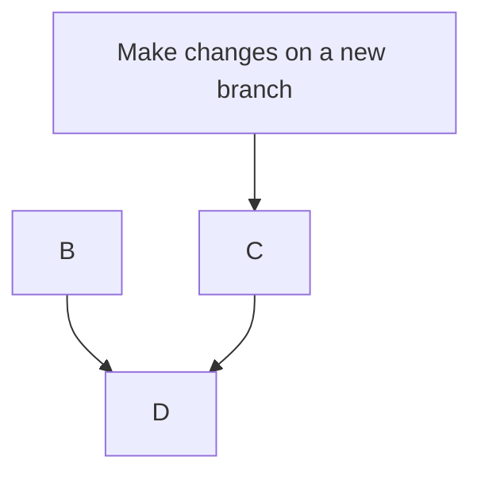

# opengeometadata.github.io

## About

This site contains documentation about OpenGeoMetadata schemas and repositories.

### Written in: [Markdown language](https://daringfireball.net/projects/markdown/)

[Markdown](https://daringfireball.net/projects/markdown/) is a lightweight and easy-to-use language for text documents.
Most text editors support it and translates easily to other formats, such as HTML or PDF or EPUB.

### Generated with: [MkDocs framework ](https://www.mkdocs.org)

[MkDocs](https://www.mkdocs.org) is a static site generator platform that allows users to create and maintain documentation websites. It takes Markdown files and uses the [Python-Markdown library](https://python-markdown.github.io) to convert the documents to HTML.

### Styled with: [Material for MkDocs theme](https://squidfunk.github.io/mkdocs-material/)

[Material](https://squidfunk.github.io/mkdocs-material/) is the most actively developed theme available for MkDocs (as of 2023) and features flexible navigation and many plugins to extend what we can do with Markdown. It is called "Material" because it is based on Google's Material Design guidelines, a web accessibility and screen responsiveness.

### Published with: [GitHub Pages](https://pages.github.com)

[GitHub Pages](https://pages.github.com) is a free static site hosting service offered by GitHub. It is often used to host documentation sites, personal portfolios, and project websites.

## GitHub Repository organization:

### Main branch

This is the working branch containing the content for the site using Markdown.

* **readme.md**: the file you are reading right now
* **mkdocs.yml**: the configuration file that identifies the theme, the extensions, and the navigation
* **docs** folder
	*  Markdown documents: The content for the site. These can all live in the same directory and are organized in the public navigation menu in the nav section of **mkdocs.yml**.
	*  	`/ogm-aardvark`: a subfolder with markdown files for each element in the Aardvark schema
	*  	/`images : JPGs, PNGs, and other image files
	*   `/javascripts/tablesort.js`: the javascript function that allows users to sort tables online
	*   `/stylesheets/extra.css` : a CSS file that can define colors, fonts, and other customizations for the site
	*   `/tables` : CSV files for any information to be included in tables

### gh-pages branch

This is the published branch containing the HTML code for the site. (We do **not** edit this branch directly).

* `index.html`: an HTML file containing the information in the `index.md` file in your Main branch
* The rest of your markdown content pages with be in separate directories. The directory name is the name of the markdown file and it contains an HTML file called `index.html`
* `/images`, `/javascripts`, and `/stylesheets` : same as the Main branch
* `/assets` : contains **subdirectories** for `/images`, `/javascripts`, and `/stylesheets`.  These subdirectories contain the favicon and compiled code.
* `.nojekyll` : The existence of this file tells GitHub that the site is not using Jekyll. [Related GitHub blog post](https://github.blog/2009-12-29-bypassing-jekyll-on-github-pages/).

## Updating the OpenGeoMetadata website

### Workflow overview

:warning: This workflow may vary from how you collaborated on other GitHub Pages sites, because we don't do Pull Requests to the branch that is actually being published (gh-pages). The site is always published from a command line interfaces using `mkdocs gh-deploy`.

MkDocs offers two commands to run in Terminal/Command Line for simplifying the process of editing and publishing GitHub pages:

* `mkdocs serve`: this will start a local server so you can preview the site as you build it. 

* `mkdocs gh-deploy`: this will convert all of the Markdown documents to HTML and publish them to a branch called **gh-pages**.

### Workflow steps

Contributor:

1. Update your local instance of the OpenGeoMetadata repository
2. Make a new branch and switch to it
3. Edit the Markdown files
4. Preview the site locally using `mkdocs serve`
5. Commit your changes
6. Publish your branch
7. Open a Pull Request to the main branch

Publisher:

1. Accept Pull Request and merge changes to the main branch
2. Update your local instance of the OpenGeoMetadata repository
3. Stay or switch to the MAIN branch
4. Preview the site locally using `mkdocs serve`
5. Publish to GitHub with `mkdocs gh-deploy`

------

All questions about this repository and contributing to it or other elements of the OpenGeoMetadata project can be directed to geoblacklight-working-group@googlegroups.com.
