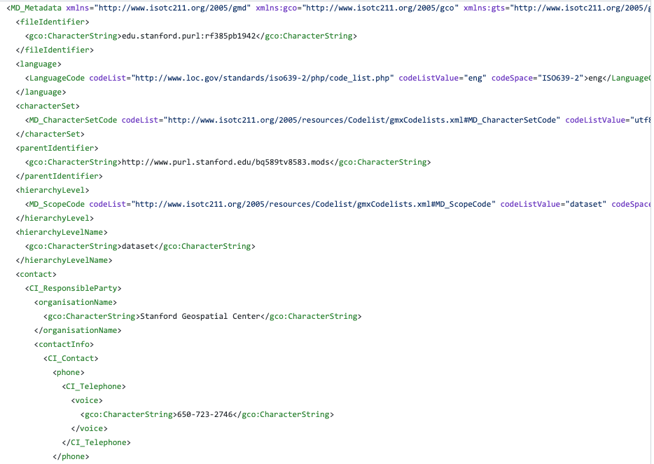
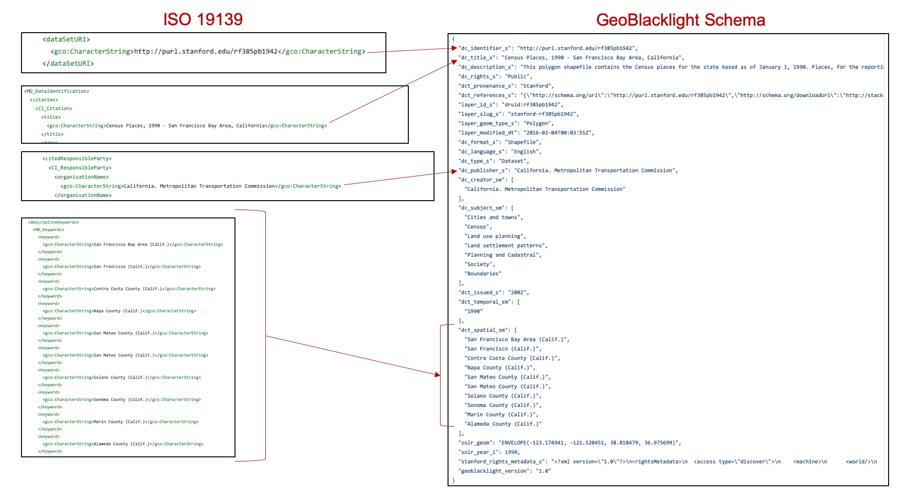
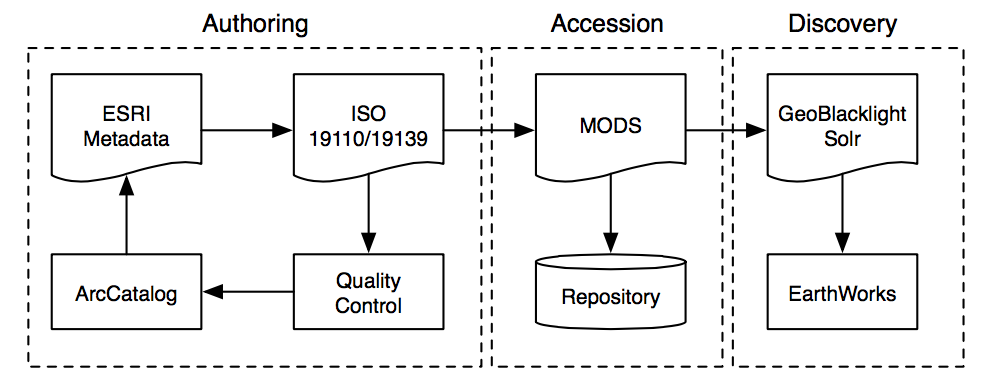

# Creating Metadata
How to create metadata records in the OpenGeoMetadata schema

## Create or collect metadata records

Step 1 of the metadata workflow is to create or collect original metadata for each layer. Depending upon the type of resource and a repository’s chosen workflows, the format of the original metadata may be in different standards or schemas.

### For resources without metadata or with very minimal metadata

**Option A: Create metadata in a non-OGM geospatial standard**

Many repositories begin the workflow by creating metadata for their resources in a geospatial metadata standard other than the OGM schema. In the United States, this standard is likely either the Federal Geographic Data Committee Content Standard for Digital Geospatial Metadata ([FGDC CSDGM](https://www.fgdc.gov/metadata/csdgm-standard)) or the International Organization for Standardization [(ISO) 191xx series](https://www.fgdc.gov/metadata/iso-standards).

The most commonly used tool for creating geospatial metadata is Esri’s ArcCatalog or ArcGIS Pro (version 2.2 and above). These applications create metadata in a proprietary format, called the ArcGIS 1.0 Metadata format, and use built-in XSLs to transform and export this format to FGDC or ISO as XML files. Note that ArcCatalog and ArcGIS Pro are limited in their default capabilities for batch-processing metadata.

**Option B: Create metadata in the OGM schema directly**

Other repositories skip Option A and create records directly in the OpenGeoMetadata metadata schema. Although users benefit from the more complete information that can be added to an FGDC or ISO document, these standards are not needed to run GeoBlacklight. These repositories often use a spreadsheet or a Dublin-Core-based metadata editor to create the records. Scripts can be used to convert spreadsheets (in .csv format) to JSON in the OpenGeoMetadata schema. See [Workflows and Tools](/workflows-and-tools.md) for example scripts.

### For resources with existing metadata files

Researchers and data providers often create geospatial metadata for their datasets, and repositories may only need to validate or augment the existing metadata records.

**Geospatial data**

A large amount of publicly available geospatial data does not have ISO or FGDC. However, it often features some kind of discovery metadata schema that is sufficient for creating OpenGeoMetadata schema records. For example, resources from public data portals, such as Socrata or ArcGIS Hub, will have metadata available in the [DCAT schema](https://www.w3.org/TR/vocab-dcat/). The metadata catalog for these portals can be accessed by appending “/data.json” to the end of the portal’s base URL. Other data portals may use a custom metadata schema, but most have APIs that can be programmatically parsed to obtain metadata for each record.

**Scanned maps**

Scanned maps from library catalogs should have MARC catalog records, and they should be able to supply the repository with metadata in the .MRC or MARC XML file format.

## Transform metadata to the OGM schema

If the metadata records are in a non-OpenGeoMetadata standard, the next step is to convert or transfer information from some or all of the fields to the OpenGeoMetadata schema. The result of this process is one or more JSON files that will be parsed and indexed by Solr. These JSON files will serve as the content to be shown in the GeoBlacklight application.

### Transformation workflows

Most institutions have their own unique set of tools and workflows to perform this transformation.  These workflows may differ depending on the type of item to be referenced.  In most cases, automation of this process is desired, although it is possible to create the JSON files manually.

The process, whether automated or manual, typically involves parsing the existing metadata record, extracting the values from selected fields and inserting the value into a new JSON document under the corresponding OpenGeoMetadata schema field. In most cases the values can simply be copied over as is, although some additional formatting may be necessary.

See [Metadata Tools](metadata-tools.md) to view custom scripts and tools for additional metadata authoring techniques.

!!! tip

	* The JSON files in the OpenGeoMetadata schema do not need to be stored with the data/items they are referencing.
	* Multiple items can be referenced in a single JSON file.
	* Some fields will contain the same values for each item (e.g. `gbl_mdVersion_s`)

### Example

A finished metadata file could look like the following example in ISO 19139 format:

The process of transforming metadata from the above formats to the OpenGeoMetadata schema involves mapping or “crosswalking” fields from one format to another.

## Example workflow

At Stanford, the [metadata records](https://github.com/OpenGeoMetadata/edu.stanford.purl) are natively authored in ESRI ArcCatalog and then transformed into ISO 19139. The ISO 19139 records are then transformed to MODS for the library catalog and GeoBlacklight for the [GeoBlacklight catalog](https://earthworks.stanford.edu/).

_Stanford University Metadata Workflow_

Take, for example, the [metadata for this layer](https://github.com/OpenGeoMetadata/edu.stanford.purl/tree/master/rf/385/pb/1942). It has the [ISO 19139](https://github.com/OpenGeoMetadata/edu.stanford.purl/blob/master/rf/385/pb/1942/iso19139.xml) version of the metadata, along with the Feature Catalog (in [ISO 19110](https://github.com/OpenGeoMetadata/edu.stanford.purl/blob/master/rf/385/pb/1942/iso19110.xml)). We also have the transformation into [MODS](https://github.com/OpenGeoMetadata/edu.stanford.purl/blob/master/rf/385/pb/1942/mods.xml) and to [GeoBlacklight](https://github.com/OpenGeoMetadata/edu.stanford.purl/blob/master/rf/385/pb/1942/geoblacklight.json), as well as a [preview image](https://github.com/OpenGeoMetadata/edu.stanford.purl/blob/master/rf/385/pb/1942/preview.jpg). In some cases, you may even have an [HTML](http://opengeometadata.stanford.edu/metadata/edu.stanford.purl/druid:rv980rt5057/iso19139.html) version of the metadata for someone to read.

## Validate the metadata

Once the metadata records are in the OpenGeoMetadata format, they should be validated to make sure the fields are correctly formatted. The current version of the schema is available as a [JSON-Schema file](https://github.com/geoblacklight/geoblacklight/tree/main/schema). This file format provides support for data validation with the [JSON Schema Vocabulary](http://json-schema.org).

### Recommended Method

Use [GeoCombine](https://github.com/OpenGeoMetadata/GeoCombine), which has a [.valid? method](http://www.rubydoc.info/gems/geo_combine/0.1.0/GeoCombine/Geoblacklight#valid%3F-instance_method) that makes using these tools simple.
