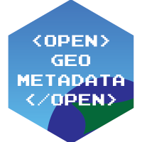

---
hide:
  - navigation
  - toc
---
# Welcome to OpenGeoMetadata

<!--{ align=right }-->

OpenGeoMetadata is a discovery metadata schema for geospatial resources and an open platform for sharing metadata files.

!!! info inline "Schemas"

	Looking for schema reference? Visit the documentation pages for **[OGM Aardvark](ogm-aardvark.md)** or **[GBL 1.0](gbl-1.0.md)** .

!!! info inline "Repositories"

	Planning to share your metadata? **[Read about our repositories](about-ogm-repositories.md)** and learn how to **[set up your own](share-on-ogm.md)**.

!!! info inline "Upgrading"

	Wanting to upgrade your metadata to the latest schema version? **[Read our upgrade guide](upgrading.md)**.

!!! question inline

	Have an idea or question about OpenGeoMetadata? **[Add an issue to GitHub](https://github.com/OpenGeoMetadata/metadata-issues/issues)**.