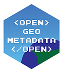
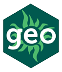

---
hide:
  - toc
  - navigation

icon: octicons/home-24
---

# Welcome to OpenGeoMetadata

OpenGeoMetadata is a discovery metadata schema for geospatial resources and an open platform for sharing metadata files.

	

		
		<h2><a href = "about-ogm-repositories"> Repositories</a></h2>

	    	Planning to share your metadata?  Read about our <a href = "about-ogm-repositories"> repositories</a> and learn how to <a href = "share-on-ogm"> set up your own</a>.
	

	

		<a href = "reference"> 
		<h2><a href = "reference"> Metadata Schemas</a></h2>
	    	Looking for schema reference and how to upgrade? Visit the <a href = "reference"> schema documentation pages</a> or <a href = "upgrade-metadata"> our Upgrade Guide</a>.

	

	

		
		<h2><a href = "ogm-aardvark"> OGM Aardvark Metadata</a></h2>
	    	Jump to the documentation for the <a href = "ogm-aardvark">Aardvark Metadata Schema</a>.

	

	

		
		<h2><a href = "gbl-1.0"> GBL 1.0 Metadata</a></h2>
	    	Jump to the documentation for the <a href = "gbl-1.0">GBL 1.0 Metadata Schema</a>.

	

(1)
{ .annotate }

1.  Aardvark icon by Sarah Rudkin from [Noun Project](https://thenounproject.com/browse/icons/term/aardvark/) (CCBY3.0)
