# Relations Fields

Fields in the "relations" group are used to describe how records relate to each other. All of them are designed to store the [ID(s)](https://opengeometadata.org/ogm-aardvark/#id) of related records. More than one record can be listed within each relationship field.

Starting in GeoBlacklight version 4.0, these fields are used to populate relationship widgets in the application sidebar, allowing users to easily explore related records and understand how they are connected. The relationship widgets are customizable in the `geoblacklight.en.yml` and `settings.yml` files.


| Field | Field Name | Obligation |
|:------|:-----------|:-----------|
| [Relation](../ogm-aardvark/#relation) | `dct_relation_sm` | Optional |
| [Member Of](../ogm-aardvark/#member-of)| `pcdm_memberOf_sm` | Optional |
| [Is Part Of](../ogm-aardvark/#is-part-of) | `dct_isPartOf_sm` | Optional |
| [Source](../ogm-aardvark/#source) | `dct_source_sm` | Optional |
| [Is Version Of](../ogm-aardvark/#is-version-of) | `dct_isVersionOf_sm` | Optional |
| [Replaces](../ogm-aardvark/#replaces) | `dct_replaces_sm` | Optional |
| [Is Replaced By](../ogm-aardvark/#is-replaced-by) | `dct_isReplacedBy_sm` | Optional |

## Relation

!!! warn

	This field should only be used for *one* of a pair of related records. If both records use this field, it will duplicate the "Related records..." widget on each item's show page. To disable this behavior, you can customize the `geoblacklight.en.yml` and `settings.yml` files in your local application.

Use this field to link to records that are related in a general or non-specific way. IDs entered in this field will populate a "Related records..." widget on the item's show page, as well as on the related item's show page. Nothing needs to be entered in the related item's metadata.

```
"dct_relation_sm": ["nyu_2451_34636"]
```

**Item's show page**

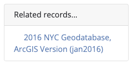

**Related item's show page**

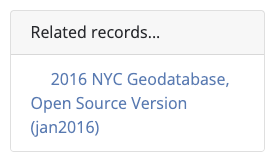

## Member Of

!!! tip

	To link items in a book or atlas, use "Is Part Of" instead.

This field links an item to its collection(s). The first step is to create a separate collection record and assign it a unique ID. Then, enter the collection item's ID in the *member item's* metadata.

IDs entered in this field in the *member item's* metadata will populate a "Belongs to collection..." widget on the member item's show page and a "Collection records..." widget on the collection item's show page. Nothing needs to be entered in the collection item's metadata.

```
"pcdm_memberOf_sm": ["umass-macconnell-1951"]
```

**Member item's show page**

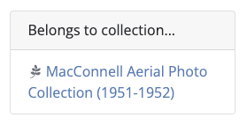

**Collection item's show page**

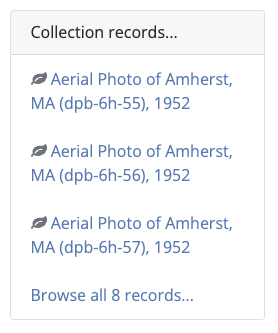

## Is Part Of

!!! tip

	To link items in a collection, use "Member Of" instead.

This field is similar to "Member Of" but is intended to link to items that are a subset of another item, like a book or atlas. The first step is to create a separate parent record and assign it a unique ID. Then, enter the parent item's ID in the *member item's* metadata.

IDs entered in this field in the *member item's* metadata will populate an "Is part of..." widget on the member item's show page and a "Has part..." widget on the parent item's show page. Nothing needs to be entered in the parent item's metadata.

```
"dct_isPartOf_sm": ["88cc9b19-3294-4da9-9edd-775c81fb1c59"]
```

**Member item's show page**

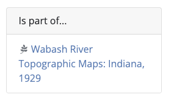

**Parent item's show page**

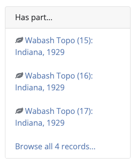

## Source

This field links an item to the dataset from which it was derived. For example, if a point shapefile is created to digitize the toponyms on a historical map, the historical map's ID would be entered in this field.

IDs entered in this field will populate a "Source records..." widget on the derived item's show page and a "Derived records..." widget on the source item's show page. Nothing needs to be entered in the source item's metadata.

```
"dct_source_sm": ["princeton-1r66j405w"]
```

**Derived item's show page**

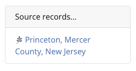

**Source item's show page**

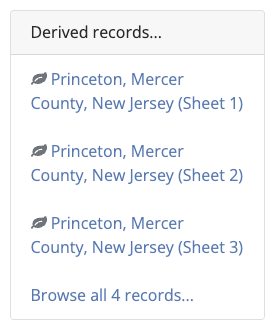

## Is Version Of

Use this field to link an item that is a version, variation, or adaptation of a pre-existing dataset. The field can contain:

* The ID of the most recent related record(s), or
* The ID of a parent record (see "Member Of" and "Is Part Of" for similar examples).

IDs entered in this field will populate an "Is version of..." widget on the item's show page and a "Has version..." widget on the linked item's show page. Nothing needs to be entered in the linked item's metadata.

```
"dct_isVersionOf_sm": ["nyu_2451_34636"]
```

**Item's show page**

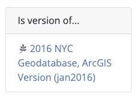

**Linked item's show page**

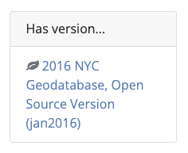

## Replaces

This field links to a deprecated version of the dataset. It is especially useful when the deprecated version is needed for reference, such as when it has been cited in a publication and must be retained in a repository.

IDs entered in this field will populate a "Replaces..." widget on the newer item's show page and an "Is replaced by..." widget on the deprecated item's show page. Nothing needs to be entered in the deprecated item's metadata.

```
"dct_replaces_sm": ["harvard-g7064-s2-1834-k3"]
```

**Newer item's show page**

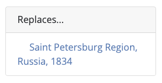

**Deprecated item's show page**

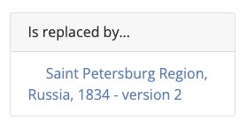

## Is Replaced By

!!! note

	This field does not trigger a relationship widget. To do so, use the "Replaces" field in the newer item's metadata record.

This field links to a newer version of the dataset. It is used for documentation purposes only, such as in the event that a deprecated record is shared with another institution. In practice, however, it may be cumbersome to update deprecated metadata records whenever a new version is created.
