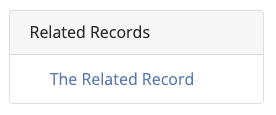
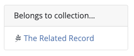

# Relations Fields

There are seven fields for describing how records relate to each other. All of these fields are designed to store the [ID(s)](https://opengeometadata.org/ogm-aardvark/#id) of related records. Their multi-valued setting allows multiple records to be listed within each relationship type.

Starting in GeoBlacklight version 4.0, these fields are used to populate relationship widgets in the application sidebar, allowing users to easily explore related records and understand how they are connected. The relationship widgets are customizable in the `geoblacklight.en.yml` and `settings.yml` files in GeoBlacklight.


| Field | Field Name | Obligation |
|:------|:-----------|:-----------|
| [Relation](../ogm-aardvark/#relation) | `dct_relation_sm` | Optional |
| [Member Of](../ogm-aardvark/#member-of)| `pcdm_memberOf_sm` | Optional |
| [Is Part Of](../ogm-aardvark/#is-part-of) | `dct_isPartOf_sm` | Optional |
| [Source](../ogm-aardvark/#source) | `dct_source_sm` | Optional |
| [Is Version Of](../ogm-aardvark/#is-version-of) | `dct_isVersionOf_sm` | Optional |
| [Replaces](../ogm-aardvark/#replaces) | `dct_replaces_sm` | Optional |
| [Is Replaced By](../ogm-aardvark/#is-replaced-by) | `dct_isReplacedBy_sm` | Optional |

## Relation
Use this field to link to records that are related in a general or non-specific way. IDs entered in this field will populate a "Related Records" widget in the application sidebar.

```
["the-related-record"]
```


## Member Of
This field lists the collection(s) to which an item belongs. A collection record must be created separately, then the collection record's ID is entered here. IDs entered in this field will populate a "Belongs to collection..." widget.

```
["the-related-record"]
```

