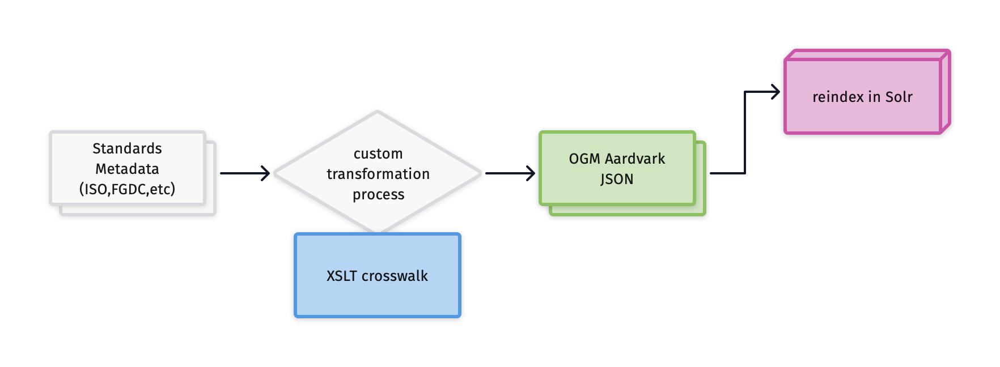
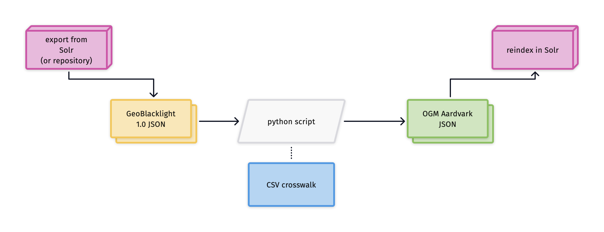

# Upgrade Guide for converting Metadata from GBL 1.0 to OGM Aardvark

**Terminology used on this page**

*   **GBL 1.0**: The legacy metadata schema designed for GeoBlacklight versions 2.0-3.7. [The schema is documented on this Legacy page.](gbl-1.0)
*   **OGM Aardvark**: The new metadata schema that is compatible with GeoBlacklight version 4.0.
*   **GeoBlacklight**: When spelled out, GeoBlacklight refers to [the application itself](https://geoblacklight.org), not its namesake legacy metadata schema, GBL 1.0.
*   **URI**: This is the name we give to the metadata element itself. For example, the URI for the Subject field is `dct_subject_sm`. 
*   **Namespace**: This is how we signify which family of standards or schemas an element belongs to. For the GeoBlacklight schema, this takes the form of the URI’s prefix. For the URI `dct_subject_sm`,  `dct_` is the prefix and signifies that this element is from Dublin Core.
*   **Solr field type**: This is the suffix appended to the URI and indicates what kind of Solr field should be indexed. For `dct_subject_sm`, the `_sm` stands for String Multiple. It indicates that the field type is a string and that it can have multiple values.
*   **Value**: This is the information that is entered in a field. It may be free text (literal value) or a URI/code (nonliteral value).

------------
## What are the differences between GBL 1.0 and OGM Aardvark?

### New elements for rights

The new set of rights elements are:

| Label              | URI                     | Description and Entry Guidelines |
|:-------------------|:------------------------|:---------------------------------|
| Access Rights      | `dct_accessRights_s`    | One of two possible values, "Public" or "Restricted"; controls whether a user can preview or download an item. This element replaces `dc_rights_s`. |
| Rights             | `dct_rights_sm`         | Free-text field for generic, catch-all access and usage rights. Can include clickable links. |
| License            | `dct_license_sm`        | Field for one or more URIs. Recommended sources are [Creative Commons](https://creativecommons.org/) or [Open Data Commons](https://opendatacommons.org/). |
| Rights Holder      | `dct_rightsHolder_sm`   | Free-text field for the person or organization owning or managing rights over the resource. |

### New elements for item relations

The new schema includes seven relationship fields. The value for each field should be the ID (slug) of the related item.

GeoBlacklight version 3.4 and earlier has an Item Relations widget that displays items identified in the **Source** field. Beginning with version 4, this has been updated to use the same widget for each of these fields
{: .note}

The new set of relationship elements are:

| Label              | URI                     | Description and Entry Guidelines |
|:-------------------|:------------------------|:---------------------------------|
| Source             | `dct_source_sm`         | For items that have been derived from another item (e.g. a digitized shapefile from a historical map). |
| Is Part Of         | `dct_isPartOf_sm`       | For items that are a subset of another item (e.g. a page in a book). This value type is changing from free-text in Version 1.0 to an ID (slug) in the new schema. |
| Member Of          | `pcdm_memberOf_sm`      | For items in a collection.       |
| Replaces           | `dct_replaces_sm`       | To refer to an item that has been deprecated. |
| Is Replaced By     | `dct_isReplacedBy_sm`   | To point the user to a new item. |
| Version            | `dct_isVersionOf_sm`    | To indicate that an item is part of a series of resources that are updated or altered. |
| Relation            | `dct_relation_sm`      | For a general purpose relation.  |

### Consistent namespaces for all metadata element URIs

OGM Aardvark gives preference to elements found in established schemas over custom fields.

* **`dct_`**: This signifies that the field is part of the [Dublin Core Metadata Initiative (DCMI) Metadata Terms](https://www.dublincore.org/specifications/dublin-core/dcmi-terms/). Any Dublin Core fields from GBL 1.0 were updated to use the `dct_` namespace, instead of `dc_`.
* **`dcat_`**: This signifies that the field is from the [Data Catalog Vocabulary (DCAT) Version 2](https://www.w3.org/TR/vocab-dcat-2/).
* **`pcdm_`**: This refers to the [Portland Common Data Model](https://github.com/duraspace/pcdm/wiki), which is a framework for many digital repository systems. We drew from it to establish one of the item relationship fields.
* **`gbl_`**: This stands for GeoBlacklight and is used for any field that is application-specific or has no analogous term in other schemas.

### Multivalued elements whenever possible

The original schema features several descriptive metadata fields that only accept one value. The new schema expands many of these to multiple. This changes the URI suffix from `_s` to` _sm`. Although it will not affect the GeoBlacklight functionality, this practice may conflict with indexing, as Solr will treat `dct_publisher_s` as a different field than `dct_publisher_sm`.

----------
## Crosswalks

---------
### Elements without a crosswalk

Most of the elements from GBL 1.0 can be crosswalked directly into OGM Aardvark. The values for these elements are the same - only the URI name has changed or the field has been converted to an array.  

However, there are three elements in GBL 1.0 that do not directly translate into OGM Aardvark. While they have been replaced with similar fields in OGM Aardvark, the **values themselves** would need to be altered during crosswalking.

**Type (dc_type_s)**
* GBL 1.0 Description: This single-valued GBL 1.0 field observes the Dublin Core controlled vocabulary for Type, including Dataset, Image, Collection, Interactive Resource, or Physical Object.
* Similar Aardvark element: This has been replaced in Aardvark with the multi-valued [Resource Class](ogm-aardvark/resource-class), which uses a custom controlled vocabulary of Collections, Datasets, Imagery, Maps, Web services, and/or Other.

**Geometry Type (layer_geom_type_s)**
* GBL 1.0 Description: This single-valued GBL 1.0 field differentiates between vector (Point, Line, Polygon), raster (Raster, Image), non-spatial formats (Table), or a combination (Mixed).
* Similar Aardvark element: This has been replaced in Aardvark with the multi-valued [Resource Type](ogm-aardvark/resource-type), which uses a controlled vocabulary drawn from Library of Congress cartographic genres and GIS geometries.

**Is Part Of (dct_isPartOf_sm)**
* GBL 1.0 Description: This multi-valued GBL 1.0 plain text field is for writing out the name of a collection. Example: `dct_isPartOf_sm:"Village Maps of India"`
* Similar Aardvark element: The URI is the same in Aardvark, but it is now a non-literal field. The value must be one or more IDs that reference another record within the system. Example: `dct_isPartOf_sm:"princeton-z603r079s"`

------
## Tools and techniques for upgrading

The following options are three ways to upgrade GBL 1.0 metadata into OGM Aardvark.  The figures include references to Solr, the search index that powers a GeoBlacklight instance.

### Option 1: Re-run the metadata pipeline with a new crosswalk

<figure>
  
  <figcaption align = "center">Fig.1 - Metadata pipeline showing a conversion from standards metadata</figcaption>
</figure>

**Scenario** 

* you have geospatial resources with structured metadata files in an official standard, such as ISO 19139, FGDC, MODS, or MARC
* your organization already has a metadata pipeline process that converts these structured files to GBL 1.0

**How does it work?** 

This option involves updating your local transformation workflow that extracts values from standards-based metadata files.

* For institutions that utilize an XSLT for the transformation, [GeoCombine repository has XSL files](https://github.com/OpenGeoMetadata/GeoCombine/tree/main/lib/xslt).

* For institutions that use custom tools or Python scripts, refer to the OGM Aardvark - FGDC- ISO 19139 crosswalk document to update the code. It shows crosswalks between OGM Aardvark, GBL 1.0, FGDC, and ISO.

**Considerations for Option #1**

* may require extra institutional support, particularly if the transformation process is part of a larger framework or connected to a repository.
* community-developed XSLs are still a work in progress

-----

### Option 2: Programmatically convert the JSON files

<figure>
  
  <figcaption align = "center">Fig.2 - Programmatic transformation process using Geoblacklight 1.0 Metadata JSONs</figcaption>
</figure>

**Scenario** 
* you only have GBL 1.0 metadata (no structured metadata files in an official standard)
* you want to test your environment with the new Aardvark schema 

**How does it work?**

1. Gather GBL 1.0 metadata JSON files on your desktop
2. Use a script or tool to convert the files batch convert GBL 1.0 JSON files to OGM Aardvark
3. Re-index the resulting Aardvark JSON files into your application (GeoBlacklight)

Currently, the OpenGeoMetadata community has two tools that can do batch conversions:

* [gbl2aardvark](https://kgjenkins.github.io/gbl2aardvark/): A web-hosted interface (recommended tool).

	* Users can upload GBL 1.0 metadata files to this tool and it will return a downloadable JSON in the OGM Aardvark schema.  
	* In addition to direct crosswalks, this tool will also populate the `Resource Class` and `Resource Type` based upon the `Type` and `Geometry Type` fields from version 1.0. It will also generate new collection level records based upon the value in the Is Part Of fields. 
	* Any fields that do not properly convert will be flagged with the phrase "EDIT ME --" 
	* When reindexing Solr with a single JSON file representing multiple records, use Solr's "Document Type"="File Upload" option.
	* [See the GitHub documentation for more information](https://github.com/kgjenkins/gbl2aardvark)

* a standalone Python script: [https://github.com/OpenGeoMetadata/gbl-1_to_aardvark](https://github.com/OpenGeoMetadata/gbl-1_to_aardvark).
   * This command line script will perform a straight conversion of field names. 
   * It features an editable crosswalk file to customize the transformation.
   * The non-crosswalkable elements listed above (Type, Geometry Type, and Is Part Of) do not have direct crosswalks and will be copied as is into the new Aardvark JSONs.

**Considerations for Option #2**

* the fastest method, but is not a long-term solution and may result in incomplete metadata

* will not include some fields that are new in OGM Aardvark, such as Rights or License. To take advantage of those fields, use Option 1 or 3.

-----
### Option 3: Conversion with manual remediation

<figure>
  
  <figcaption align = "center">Fig.3 - Transformation process that includes manual remediation</figcaption>
</figure>

**Scenario**

* you have GBL 1.0 metadata files
* you want to minimize data loss and corrupted output values
* you have staff time available for manual work

**How does it work?**

This technique combines automatic conversions and manual edits:

1. Convert your GBL 1.0 metadata files to a CSV. [This Python script will convert a batch of JSONs to a CSV file](https://github.com/geobtaa/workflows/blob/main/editing/json2csv.py)

2. Manually augment and adjust column names and values using spreadsheet functions.

3. Convert your spreadsheet to OGM Aardvark JSONs. [This Python script will convert CSVs to Aardvark JSONS](https://github.com/jhu-library-applications/geoportal/tree/main/aardvark)

**Considerations for Option #3**

* more likely to produce normalized, consistent values than Options 1 or 2.

* may require extra dedicated staff time

* could be adjusted to work with the extracted metadata from standards files 